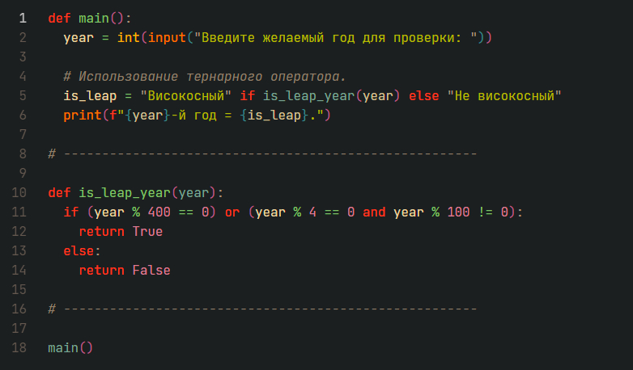

## Краткое вступление

В данном репозитории находятся решения 36 различных алгоритмических задач, взятых из открытых источников в Интернете, а также из сборника задач по программированию (автор: Златопольский Д. М.).

Формулировки многих задач для большего интереса были дополнены и усложнены.

Исходный код представлен на языке программирования Python (версия интерпретатора = 3.10.12).

• • • • • • • • • • • • • • • • • • • • • • • • • • • • • • • • • • • •

<details><summary>Установка и запуск решений на компьютере:</summary>

<br>

Для запуска скриптов необходимо клонировать [(скачать)](https://github.com/sudomango/Python-Algo-A/archive/refs/heads/main.zip) весь репозиторий.

```shell
git clone https://github.com/sudomango/Python-Algo-A.git
```

Также для запуска 3-ей задачи необходимо установить модуль pytz (Python Timezones):

```shell
pip install pytz
```

Любой скрипт следует запускать **только из каталога, в котором он расположен**, ни из какого другого.

Запуск решений в командной строке Windows:

```shell
cd Block_##
python script_name.py
```

Для Linux команда будет немного отличаться (проверено на Ubuntu Server):

```shell
cd Block_##
python3 script_name.py
```

Далее действуем согласно инструкциям скрипта и условиям конкретной задачи.

</details>

<div style="margin-top: 16px"></div>

• • • • • • • • • • • • • • • • • • • • • • • • • • • • • • • • • • • •

## Список задач в репозитории

<details><summary>Первый блок задач (задачи 01 - 10):</summary>

<br>

01\. Интерполяция переменных: вывести "Hello, World!", после чего запросить имя пользователя и вывести в терминале "Hello, \<username\>!".

[Исходный код решения](https://github.com/sudomango/Python-Algo-A/blob/main/Block_01/01%20-%20hello_world.py)

02\. Функция, которая проверяет, является ли указанный год високосным.

[Исходный код решения](https://github.com/sudomango/Python-Algo-A/blob/main/Block_01/02%20-%20is_leap_year.py)

03\. Вывести в терминале текущую дату и время в удобном для чтения формате (например, "Текущая дата и время: 10.10.2023 13:56:23, день недели: вторник.").

[Исходный код решения](https://github.com/sudomango/Python-Algo-A/blob/main/Block_01/03%20-%20cur_date_and_time.py)

04\. Функция, которая проверяет, является ли число, переданное в качестве аргумента, простым.

[Исходный код решения](https://github.com/sudomango/Python-Algo-A/blob/main/Block_01/04%20-%20is_prime_number.py)

05\. Функция, которая генерирует одномерный массив случайных целых чисел размером count. Все числа должны находиться в диапазоне min_value ... max_value. Дополнительно следует реализовать возможность генерации массива, состоящего только из уникальных (неповторяющихся) элементов.

[Исходный код решения](https://github.com/sudomango/Python-Algo-A/blob/main/Block_01/05%20-%20random_int_array.py)

06\. Дан одномерный массив чисел размером k (1 <= k <= 1000). Вывести на экран минимальный, максимальный элементы массива, а также сумму и среднее арифметическое всех элементов массива.

[Исходный код решения](https://github.com/sudomango/Python-Algo-A/blob/main/Block_01/06%20-%20min_max_sum.py)

07\. Фильтрация исходного массива: Дан массив из 100 случайных целых чисел. Создать два новых массива на основе первого = в первом оставить только чётные положительные числа, во втором - двузначные числа, кратные 10. Вывести оригинальный массив и оба получившихся массива на экран консоли.

[Исходный код решения](https://github.com/sudomango/Python-Algo-A/blob/main/Block_01/07%20-%20array_filter.py)

08\. Перевернуть все символы в строке, не используя встроенные в язык методы, типа string.reverse и слайсы.

[Исходный код решения](https://github.com/sudomango/Python-Algo-A/blob/main/Block_01/08%20-%20string_reverse.py)

09\. Поменять значения двух целочисленных переменных, не используя при этом третью (три способа).

[Исходный код решения](https://github.com/sudomango/Python-Algo-A/blob/main/Block_01/09%20-%20swap_variables.py)

10\. Использование ассоциативных массивов: Зарплата сотрудника вычисляется по формуле = 1000$ + 20$ за каждый отработанный час + 30$ за каждого нового клиента. Подсчитать зарплату каждого из сотрудников. Вывести их в порядке от "лучшего" к "худшему". Каждый сотрудник представляет собой ассоциативный массив.

[Исходный код решения](https://github.com/sudomango/Python-Algo-A/blob/main/Block_01/10%20-%20salary_amount_calculate.py)

</details>

<div style="margin-top: 16px"></div>

• • • • • • • • • • • • • • • • • • • • • • • • • • • • • • • • • • • •

<details><summary>Второй блок задач (задачи 11 - 20):</summary>

<br>

11\. Задача номер 9, но для строковых переменных (поменять их значения, не используя при этом третью).

[Исходный код решения](https://github.com/sudomango/Python-Algo-A/blob/main/Block_02/11%20-%20swap_two_strings.py)

12\. Нарисовать в терминале фигуру "ёлочка" из символов * (снежинка) и пробелов (располагаются между снежинками). Ёлочка должна быть симметричной, на первой строке = одна снежинка, на второй = две и т. д. Высота ёлочки задаётся пользователем, но она не должна превышать 40 строк (необходимо проверить этот параметр программно). Желательно продумать и реализовать рекурсивный алгоритм отрисовки.

[Исходный код решения](https://github.com/sudomango/Python-Algo-A/blob/main/Block_02/12%20-%20recursion_tree.py)

13\. Вывести на экран длину вектора по трём заданным координатам = x, y, z.

[Исходный код решения](https://github.com/sudomango/Python-Algo-A/blob/main/Block_02/13%20-%20vector_length.py)

14\. Дан список продуктов на складе. У каждого есть срок его изготовления и срок годности (всегда указан в днях). Необходимо проверить, какие продукты на текущую дату можно считать просроченными, а какие - всё ещё свежими. Даты можно указать любые, главное, чтобы было видно, что функция работает правильно.

[Исходный код решения](https://github.com/sudomango/Python-Algo-A/blob/main/Block_02/14%20-%20is_still_fresh.py)

15\. Реализовать программу "Калькулятор для вклада". Пользователь вводит начальную сумму и количество месяцев, после чего должен получить финальную сумму, которая будет на вкладе по истечению указанного им срока. Условия вклада такие: любая сумма до 6 месяцев (включительно) = 6.5% годовых; если вклад делается на срок больше 6 месяцев, то для сумм больше 500.000 процентная ставка = 8%, для сумм меньших или равных 500.000 = 10%. Все вклады идут с ежемесячной капитализацией процентов (проценты каждый месяц прибавляются к сумме вклада, и в новом месяце процент считается уже от новой суммы).

Так как это учебная программа, результат при выводе разрешается округлить до 2-3 знаков после запятой.

[Исходный код решения](https://github.com/sudomango/Python-Algo-A/blob/main/Block_02/15%20-%20deposit_calculator.py)

16\. Необходимо рекурсивно обойти все элементы двумерного кортежа и вывести их на экран в виде матрицы (через пробел или через запятую).

Например: двумерный кортеж = ((1, -4, 5), (12, 0, -9), (3, 10, 83)). На экране должно получиться:

1, -4, 5<br>
12, 0, -9<br>
3, 10, 83

В кортеже могут быть только целые числа (положительные и отрицательные). Порядок рекурсивного обхода - на усмотрение разработчика.

[Исходный код решения](https://github.com/sudomango/Python-Algo-A/blob/main/Block_02/16%20-%20read_array_recursive.py)

17\. Даны две строки, необходимо выяснить являются ли они анаграммами? В содержании строк следует учитывать только буквы и цифры. Пробелы и знаки препинания необходимо удалить или игнорировать их при сравнении. Сравнение сделать case-insensitive (регистронезависимым).

[Исходный код решения](https://github.com/sudomango/Python-Algo-A/blob/main/Block_02/17%20-%20is_an_anagram.py)

18\. Количество вхождений элемента в последовательность: В текстовом файле записана произвольная строка или текст. Пользователь вводит символ или подстроку. Необходимо вывести, какое количество раз она повторяется в исходном тексте. Поиск сделать case-insensitive (регистронезависимым).

[Исходный код решения](https://github.com/sudomango/Python-Algo-A/blob/main/Block_02/18%20-%20repeated_elements_count.py)

19\. Пользователь вводит две даты в заданном формате. Необходимо вывести разницу между датами в днях.

[Исходный код решения](https://github.com/sudomango/Python-Algo-A/blob/main/Block_02/19%20-%20two_dates_difference.py)

20\. Реализовать функции dec_to_hex, hex_to_dec, dec_to_bin, bin_to_dec, rgb_to_hex, hex_to_rgb без использования аналогичных функций, встроенных в язык программирования. Входные данные = целые неотрицательные числа в указанной системе счисления в виде строки: "40AC20", "600", "1011011" и т. д. RGB-цвет должен быть представлен в виде кортежа из трёх целочисленных значений (0 .. 255).

[Исходный код решения](https://github.com/sudomango/Python-Algo-A/blob/main/Block_02/20%20-%20dec_to_hex%2C%20hex_to_dec.py)

</details>

<div style="margin-top: 16px"></div>

• • • • • • • • • • • • • • • • • • • • • • • • • • • • • • • • • • • •

<details><summary>Третий блок задач (задачи 21 - 30):</summary>

<br>

21\. Реализовать функцию, которая выводит на экран все делители указанного натурального числа.

[Исходный код решения](https://github.com/sudomango/Python-Algo-A/blob/main/Block_03/21%20-%20find_all_divisors.py)

22\. Функция, которая раскладывает натуральное число (n > 1) на простые сомножители.

[Исходный код решения](https://github.com/sudomango/Python-Algo-A/blob/main/Block_03/22%20-%20factorize_the_number.py)

23\. Решето Эратосфена: Вывести список всех простых чисел в диапазоне от 2 до \<user_number\>.

[Исходный код решения](https://github.com/sudomango/Python-Algo-A/blob/main/Block_03/23%20-%20prime_numbers_array.py)

24\. Реализовать две функции для целочисленной арифметики денежных единиц: одна - для сложения, вторая - для вычитания. Мы знаем, что представление дробной части вещественного числа в компьютере не всегда точное из-за особенностей двоичной арифметики. Поэтому для денежных единиц обычно создаётся отдельный объект, в котором реализованы свои методы для арифметических операций с этим объектом. Копейки считаются отдельно, а рубли - отдельно. Так как мы пока не затрагиваем ООП, предлагается реализовать описанный функционал через ассоциативные массивы (словари).

[Исходный код решения](https://github.com/sudomango/Python-Algo-A/blob/main/Block_03/24%20-%20money_true_calculation.py)

25\. Найти и распечатать самое длинное и самое короткое слово в текстовом файле. Знаки препинания и пробелы при подсчёте не учитывать!

[Исходный код решения](https://github.com/sudomango/Python-Algo-A/blob/main/Block_03/25%20-%20longest_and_shortest_word.py)

26\. Матричная арифметика = целых четыре подзадачи в одной. В дальнейшем считать матрицу и двумерный список (кортеж) синонимами. Все индексы будем считать с нуля.

Итак, дана квадратная матрица 5-го порядка. Можно наполнить её любыми целыми числами.

A\. Вывести на экран исходную и транспонированную ей матрицу. Вывод обязательно реализовать с выравниванием по столбцам.

B\. Вывести сумму элементов с чётными индексами на главной диагонали. Например: A[0][0], A[2][2] и т. д. Исходная матрица может быть любого размера (но она обязательно будет квадратной).

C\. Вывести последнюю цифру суммы всех элементов на главной и побочной диагоналях.

D\. Найти и вывести минимальный элемент матрицы и координаты (индексы) его последнего вхождения.

[Исходный код решения](https://github.com/sudomango/Python-Algo-A/blob/main/Block_03/26%20-%20matrix_arithmetic.py)

27\. Реализовать две функции: Первая вычисляет, является ли указанная строка палиндромом. Вторая делает тоже самое, но для целых неотрицательных чисел. Можно использовать любой известный алгоритм для вычисления палиндромов.

[Исходный код решения](https://github.com/sudomango/Python-Algo-A/blob/main/Block_03/27%20-%20palindrome_function.py)

28\. Дан массив из натуральных чисел. Найти НОД для всех чисел в указанном массиве.

[Исходный код решения](https://github.com/sudomango/Python-Algo-A/blob/main/Block_03/28%20-%20nod_of_the_array.py)

29\. Дан массив случайных чисел. Сложить отдельно положительные, отдельно - отрицательные числа. Обе суммы вывести на экран. Ноль не относится ни к первым, ни ко вторым.

[Исходный код решения](https://github.com/sudomango/Python-Algo-A/blob/main/Block_03/29%20-%20sum_of_pos_and_neg.py)

30\. Дан массив случайных чисел. Вывести на экран только уникальные (неповторяющиеся) элементы.

[Исходный код решения](https://github.com/sudomango/Python-Algo-A/blob/main/Block_03/30%20-%20unique_elements.py)

</details>

<div style="margin-top: 16px"></div>

• • • • • • • • • • • • • • • • • • • • • • • • • • • • • • • • • • • •

<details><summary>Четвёртый блок задач (задачи 31 - 36):</summary>

<br>

31\. Заменить в текстовом файле все вхождения одной подстроки на другую (Replace In File).

[Исходный код решения](https://github.com/sudomango/Python-Algo-A/blob/main/Block_04/31%20-%20replace_all_in_text_file.py)

32\. Вывести на экран сумму всех цифр указанного числа (функция должна работать в том числе и для отрицательных чисел, и для вещественных).

[Исходный код решения](https://github.com/sudomango/Python-Algo-A/blob/main/Block_04/32%20-%20sum_of_all_digits.py)

33\. Реализовать функцию, которая удаляет в текстовом файле случайные лишние пробелы в конце строки. Другими словами, каждая строка в файле должна быть либо пустой, либо обязательно заканчиваться каким-то визуально видимым символом (не пробелом!).

[Исходный код решения](https://github.com/sudomango/Python-Algo-A/blob/main/Block_04/33%20-%20function_antispace.py)

34\. Программа, появившаяся случайно в ходе решения задач. Внести в программу две функции по поиску простых чисел - одна реализует наивный улучшенный алгоритм из задачи 04, вторая - Решето Эратосфена из задачи 23. Сравнить время их работы для какого-то достаточно большого n. Результаты вывести на экран.

[Исходный код решения](https://github.com/sudomango/Python-Algo-A/blob/main/Block_04/34%20-%20prime_numbers_speed_test.py)

35\. Дан текстовый файл. Необходимо подсчитать среднюю длину слова. Текст предварительно очистить от пробелов и лишних знаков препинания при помощи регулярного выражения.

[Исходный код решения](https://github.com/sudomango/Python-Algo-A/blob/main/Block_04/35%20-%20text_avg_word_length.py)

36\. Найти и вывести на экран НОД и НОК для двух указанных натуральных чисел. Разрешается использовать любой известный алгоритм, кроме встроенных в язык программирования функций.

[Исходный код решения](https://github.com/sudomango/Python-Algo-A/blob/main/Block_04/36%20-%20nok_and_nod_of_two_numbers.py)

</details>

<div style="margin-top: 16px"></div>

• • • • • • • • • • • • • • • • • • • • • • • • • • • • • • • • • • • •

## Некоторые примечания

Весь код проверен на работоспособность на Windows 10 и Ubuntu Server 22.04, результат выполнения всегда соответствует поставленному условию задачи.



Весь исходный код **служит для учебных целей**, в связи с чем в нём могут встречаться различные пояснительные комментарии, не всегда оптимальные алгоритмы, отладочная информация и так далее.
